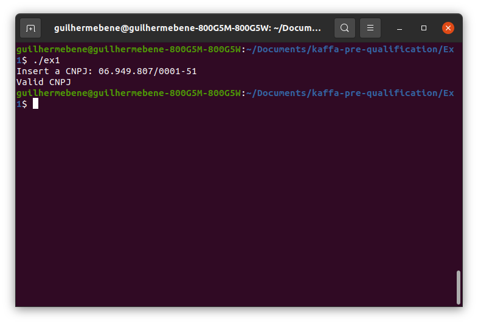
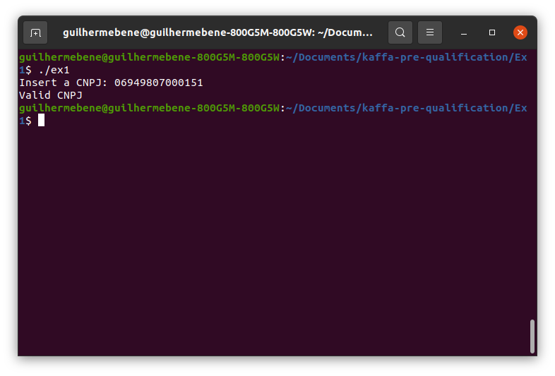

# Exercise 1 - CPNJ validation

## Requirements
---

* gcc compiler ([mingw-64](http://mingw-w64.org/doku.php) for Windows)

## Compilation
---

On Windows:

```
gcc ex1.c -o ex1.exe
```

On Linux:
```
gcc ex1.c -o ex1
```

## Results
---
A valid CNPJ can either be inserted with the punctuation marks such as in:



Or with a numerical input:




