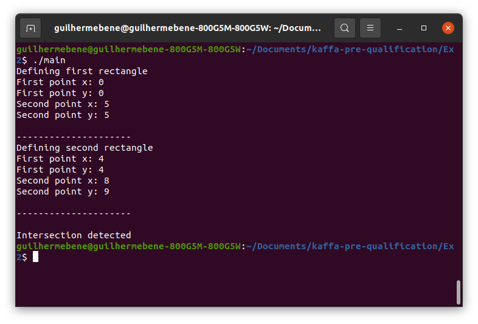

# Exercise 2 - Rectangle intersection

The logic of this program is to actually detect if two rectangles do not intersect, otherwise they intersect.

## Requirements
---

* g++ compiler ([mingw-64](http://mingw-w64.org/doku.php) for Windows)

## Compilation
---

On Windows:

```
g++ -o main.exe main.cpp ../Rectangle Rectangle.cpp
```

On Linux:
```
g++ -o main main.cpp ../Rectangle/Rectangle.cpp
```

## Results
---



