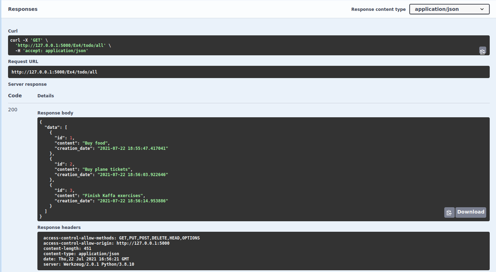
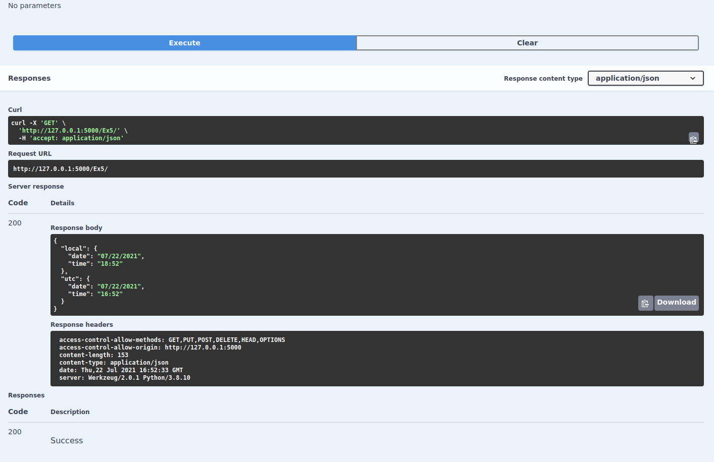

# app

An API based on the microframework Flask and Python. 

A SQLite3 database is used with a single column named TODO that saves added TO-DOs.

It defines routes for exercises 4, 5 and 6.

## Requirements
---
* Python
* SQL3 (in case you are using Windows, you must add SQL3's installation path to your environment variables in PATH)

## Installation
---
In a virtual environment, install dependencies using:
```
pip install -r requirements.txt
```

Run `create_db.py` to generate the database.
```
python create_db.py
```

Run `main.py` to start the server:
```
python main.py
```

## Routes
---

### Exercise 4
For exercise 4, three routs are available:
* /Ex4/todo/all - [GET] returns all TO-DOs registered in the database

  

* /Ex4/todo/new - [POST] adds a new TO-DO to the database

  

* /Ex4/todo/delete - [POST] removes a TO-DO from database

  

### Exercise 5
A single route /Ex5/ [GET] returns the local and UTC time fetched from [ http://worldclockapi.com/api/json/utc/now]( http://worldclockapi.com/api/json/utc/now).



### Exercise 6
A single route /Ex6/ [GET] returns a JSON containing the local date and time.


## Results
---


